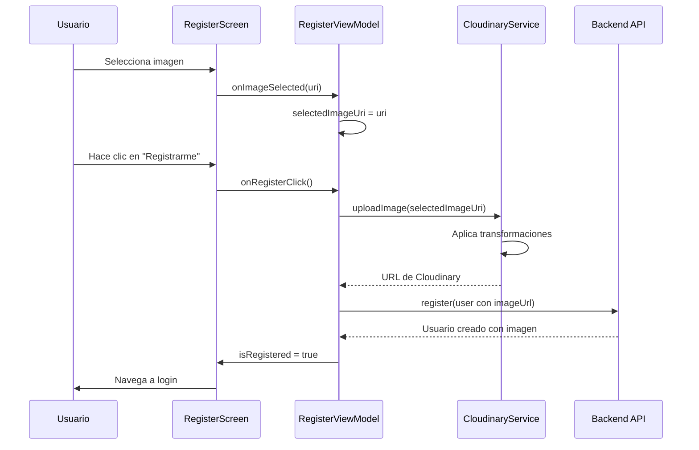
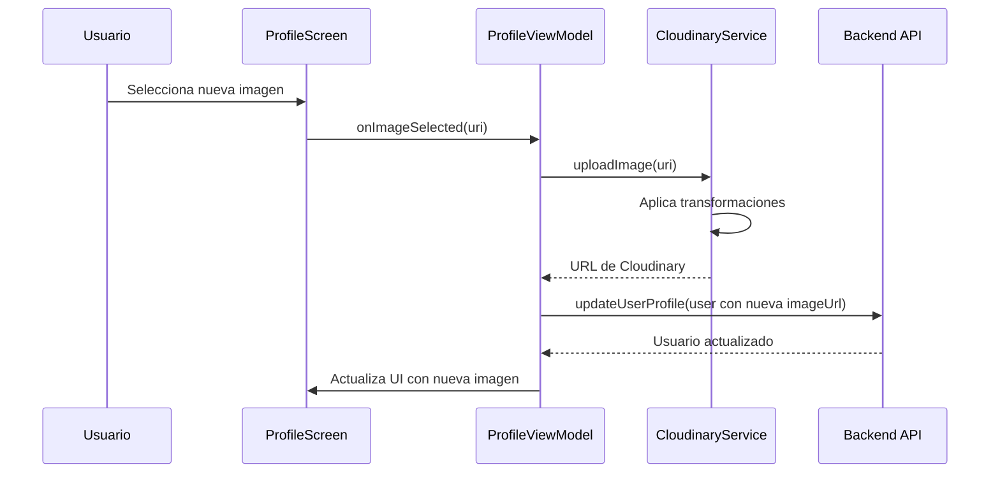

# Cloudinary Integration

## Descripción General

Cloudinary es un servicio de gestión de medios en la nube que utilizamos para el almacenamiento, transformación y entrega optimizada de imágenes de perfil de usuario en nuestra aplicación e-commerce.

## Configuración

### 1. Dependencias

```kotlin
// core/cloudinary/build.gradle.kts
implementation("com.cloudinary:cloudinary-android:3.0.2")
```

### 2. API Keys y Configuración

Las credenciales de Cloudinary se configuran de forma segura:

```properties
# local.properties
CLOUDINARY_CLOUD_NAME=your_cloud_name
CLOUDINARY_API_KEY=your_api_key
CLOUDINARY_API_SECRET=your_api_secret
```

```kotlin
// app/build.gradle.kts - BuildConfig
buildConfigField("String", "CLOUDINARY_CLOUD_NAME", "\"${project.findProperty("CLOUDINARY_CLOUD_NAME")}\"")
buildConfigField("String", "CLOUDINARY_API_KEY", "\"${project.findProperty("CLOUDINARY_API_KEY")}\"")
buildConfigField("String", "CLOUDINARY_API_SECRET", "\"${project.findProperty("CLOUDINARY_API_SECRET")}\"")
```

### 3. Inyección de Dependencias

```kotlin
// app/src/main/java/com/luciaaldana/eccomerceapp/di/CloudinaryModule.kt
@Module
@InstallIn(SingletonComponent::class)
object CloudinaryModule {
    
    @Provides
    @Singleton
    fun provideCloudinaryConfig(): CloudinaryConfig {
        return CloudinaryConfig(
            cloudName = BuildConfig.CLOUDINARY_CLOUD_NAME,
            apiKey = BuildConfig.CLOUDINARY_API_KEY,
            apiSecret = BuildConfig.CLOUDINARY_API_SECRET
        )
    }
    
    @Provides
    @Singleton
    fun provideCloudinaryService(config: CloudinaryConfig): CloudinaryService {
        return CloudinaryService(config)
    }
}
```

## Arquitectura

### Ubicación en la Arquitectura

```
app/
├── core/
│   └── cloudinary/           # Módulo centralizado de Cloudinary
│       ├── CloudinaryConfig.kt
│       └── CloudinaryService.kt
├── core/ui/components/
│   └── ProfileImagePicker.kt # Componente reutilizable
├── feature/
│   ├── register/             # Uso en registro
│   └── profile/              # Uso en perfil
```

### Principios de Diseño

- **Centralización**: El servicio está en el módulo `core/cloudinary` para reutilización
- **Seguridad**: Las API keys nunca están hardcodeadas en el código
- **Separación de responsabilidades**: CloudinaryService solo maneja uploads, UI se encarga de la selección

## Implementación

### CloudinaryService

```kotlin
@Singleton
class CloudinaryService @Inject constructor(
    private val config: CloudinaryConfig
) {
    init {
        MediaManager.init(Cloudinary(config.toMap()))
    }

    suspend fun uploadImage(uri: Uri): String = suspendCancellableCoroutine { continuation ->
        MediaManager.get().upload(uri)
            .option("folder", "profile_images")
            .option("transformation", "c_thumb,w_300,h_300,g_face,r_max")
            .option("format", "jpg")
            .option("quality", "auto")
            .callback(object : UploadCallback {
                override fun onStart(requestId: String?) {}
                
                override fun onProgress(requestId: String?, bytes: Long, totalBytes: Long) {}
                
                override fun onSuccess(requestId: String?, resultData: MutableMap<Any?, Any?>?) {
                    val secureUrl = resultData?.get("secure_url") as? String
                    if (secureUrl != null) {
                        continuation.resume(secureUrl)
                    } else {
                        continuation.resumeWithException(Exception("No se pudo obtener URL de imagen"))
                    }
                }
                
                override fun onError(requestId: String?, error: ErrorInfo?) {
                    continuation.resumeWithException(Exception(error?.description ?: "Error desconocido"))
                }
                
                override fun onReschedule(requestId: String?, error: ErrorInfo?) {}
            })
            .dispatch()
    }
}
```

### Transformaciones Aplicadas

- **c_thumb**: Crop thumbnail
- **w_300,h_300**: Redimensionar a 300x300 píxeles
- **g_face**: Gravity face (centra en la cara detectada)
- **r_max**: Border radius máximo (imagen circular)
- **format=jpg**: Convertir a JPG
- **quality=auto**: Calidad automática optimizada

## Flujo de Uso

### 1. Registro de Usuario



**Características específicas del registro:**
- **Subida diferida**: La imagen se sube cuando el usuario hace clic en "Registrarme"
- **Manejo de errores**: Si falla la subida, el registro continúa sin imagen
- **Fallback**: Si no se selecciona imagen, el backend asigna una imagen genérica

### 2. Edición de Perfil



**Características específicas del perfil:**
- **Subida inmediata**: La imagen se sube al seleccionarla
- **Feedback visual**: Loading indicator durante la subida
- **Preview instantáneo**: La imagen se muestra inmediatamente

## Componente ProfileImagePicker

### Ubicación
`core/ui/src/main/java/com/luciaaldana/eccomerceapp/core/ui/components/ProfileImagePicker.kt`

### API del Componente

```kotlin
@Composable
fun ProfileImagePicker(
    imageUrl: String?,                    // URL actual de la imagen
    isUploading: Boolean,                 // Estado de carga
    onImageSelected: (Uri) -> Unit,       // Callback al seleccionar imagen
    modifier: Modifier = Modifier,
    showEditIndicator: Boolean = false    // Mostrar indicador de edición
)
```

### Funcionalidades

- **Selección desde galería**: Usando ActivityResultContracts.GetContent()
- **Captura con cámara**: Usando ActivityResultContracts.TakePicture()
- **Permisos**: Manejo automático de permisos de cámara
- **Estados visuales**: Loading, error, placeholder
- **Indicador de edición**: Ícono overlay cuando es editable

### Uso en Diferentes Pantallas

```kotlin
// En RegisterScreen
ProfileImagePicker(
    imageUrl = viewModel.userImageUrl,
    isUploading = viewModel.isUploadingImage,
    onImageSelected = { uri -> viewModel.onImageSelected(uri) }
)

// En ProfileScreen  
ProfileImagePicker(
    imageUrl = currentUser?.userImageUrl,
    isUploading = viewModel.isUploadingImage,
    onImageSelected = { uri -> viewModel.onImageSelected(uri) },
    showEditIndicator = true  // Muestra ícono de edición
)
```

## Estrategias de Upload

### Registro (Upload Diferido)
- **¿Por qué?**: Evita imágenes huérfanas si el usuario cancela el registro
- **¿Cuándo?**: Solo cuando el usuario confirma el registro
- **Manejo de errores**: Continúa el registro sin imagen si falla

### Perfil (Upload Inmediato)
- **¿Por qué?**: Feedback inmediato al usuario
- **¿Cuándo?**: Al seleccionar la imagen
- **Manejo de errores**: Muestra error pero mantiene imagen anterior

## Consideraciones de Rendimiento

### Optimizaciones Aplicadas

1. **Transformaciones en servidor**: Cloudinary redimensiona y optimiza las imágenes
2. **Formato eficiente**: Conversión automática a JPG
3. **Calidad adaptiva**: `quality=auto` ajusta según el contenido
4. **CDN global**: Cloudinary distribuye las imágenes desde CDN

### Tamaño de Imágenes

- **Original**: Cualquier tamaño/formato que suba el usuario
- **Transformada**: 300x300px, circular, optimizada
- **Peso aproximado**: 15-30KB por imagen de perfil

## Seguridad

### Buenas Prácticas Implementadas

1. **API Keys seguras**: 
   - Almacenadas en `local.properties`
   - Nunca commiteadas al repositorio
   - Accedidas vía BuildConfig

2. **Validación de archivos**:
   - Solo imágenes a través de los contracts de Android
   - Cloudinary valida formatos en servidor

3. **Carpeta organizada**:
   - Todas las imágenes de perfil en `/profile_images/`
   - Fácil gestión y backup

## Troubleshooting

### Problemas Comunes

1. **Error de inicialización**:
   ```
   Solution: Verificar que las API keys estén correctamente configuradas en local.properties
   ```

2. **Timeout en upload**:
   ```
   Solution: CloudinaryService usa suspendCancellableCoroutine para manejo async correcto
   ```

3. **Imagen no se muestra**:
   ```
   Solution: Verificar que la URL retornada sea 'secure_url' (HTTPS)
   ```
